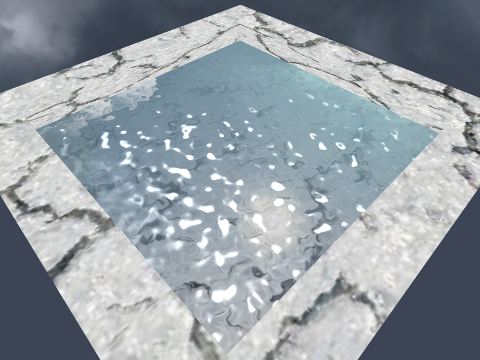

# Water simulation based on du/dv map and normal map

Details of this technique can be found [here](https://www.youtube.com/watch?v=HusvGeEDU_U&list=PLRIWtICgwaX23jiqVByUs0bqhnalNTNZh).

* Use W, A, S, D to move around.
* Use mouse to look around.
* Use Y to save a frame. The default file name is "output.png".

# Result

