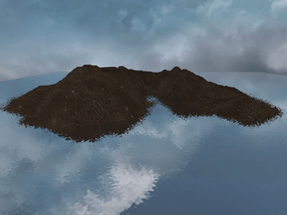

# Water simulation based on du/dv map and normal map

Details of this technique can be found [here](https://www.youtube.com/watch?v=HusvGeEDU_U&list=PLRIWtICgwaX23jiqVByUs0bqhnalNTNZh).

* Use W, A, S, D to move around.
* Move your mouse to look around.
* Use Y to save frames.

Environment
* OpenGL 4.1
* GLSL 4.10
* OS X El Capitan 10.11.x, macOS High Sierra 10.13.x

# Result
[youtube](https://www.youtube.com/watch?v=6ZinqN4Jzis)

