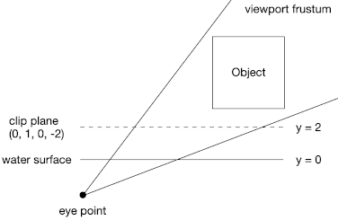

# Water simulation based on dudv map

From puddles to ponds, we can see ripples everywhere in the real world.
Their change in the height can be ignored even we change our view point.
This method is suitable for simulating those ripples,
and it is used widely in video games (e.g. *Dark Souls*).

I implement this method based on the video of [ThinMatrix](https://www.youtube.com/watch?v=HusvGeEDU_U&list=PLRIWtICgwaX23jiqVByUs0bqhnalNTNZh) and the paper of [Rene Truelsen](http://image.diku.dk/projects/media/rene.truelsen.07.pdf).

# Dudv map

A [dudv map](http://wiki.polycount.com/wiki/DuDv_map) is a texture used to distort another texture.
`du` and `dv` are offsets applied to some texture coordinate `(u, v)`,
i.e. using `(u + du, v + dv)` to sample a texture instead of `(u, v)`.
`(du, dv)` pairs are recorded in a texture (or a lookup table).
As a result, the original texture is distorted to a certain pattern.

## Questions about generating dudv map

Many articles point out that the dudv map is the first order derivative of a normal map.
But unfortunately, none of them have explained why.

The only thing that I can understand is as following:


When the original plane is (imaginarily) distorted to a curved surface,
the normal of a certain point changes.
Subsequently, the reflection of this point changes from `(u, v)` to `(u + du, v + dv)`.
The offset `(du, dv)` is what we want to calculate,
and it is related to the change of normal.

The first derivative of normal, i.e.`(d(nx)/dx, d(ny)/dy, d(nz)/dz)`,
represents the change of normal in space,
not the change of normal between the original plane and the distorted one.
This confuses me a lot,
and none of those articles have provided more details.

Personally, I think `(du, dv) <- (n1 - n2).xz * someScale` makes more sense.
`(n1 - n2)` represents the geometry difference between the original plane and the distorted one,
and `someScale` is a scalar to adjust this difference.

## A guess

As the normal map used in the water simulation has a wavy pattern,
its first derivative of `(x, y, z)`,
i.e. the change of surface normals in the space, also has a wavy pattern.
Therefore, distorting the water texture with this wavy pattern can produce a wavy surface.

I guess the key is how to get a wavy pattern that is related to surface normals,
not the difference between the original plane and the distorted one.

# User-defined clip plane

The reflection and refraction textures are faked by a technique called [user-defined clip plane](https://www.khronos.org/opengl/wiki/Vertex_Post-Processing#User-defined_clipping).

We specify a plane `(A, B, C, D)`, with `(A, B, C)` being its normal and `D` being its distance to `(0, 0, 0)`.
For a point `P` in the space, `dot(P, plane)` gives the relationship between `P` and `plane`.
Here, `P` is expanded to `vec4` with `w = 1`.

```
dot(P, plane) >= 0 --> non-negative side of the plane --> inside clipping space
dot(P, plane) < 0 --> negative side of the plane --> outside clipping space
```

Points on the negative side of the plane will not be rendered.

For example, in this program, I define a clip plane for refraction texture as following:



and in vertex shader:

```
gl_ClipDistance[0] = -dot(M * vec4(vtxCoord, 1.0), clipPlane0);
```

This operation makes points under `plane0` be inside the clipping space,
and we get a faked underwater scene.

For the reflection texture, `plane1 = vec4(0, 1, 0, -3)` is defined, and

```
gl_ClipDistance[1] = dot(M * vec4(vtxCoord, 1.0), clipPlane1);
```

is executed.
This makes points over `plane1` be inside the clipping space,
and we get a faked overwater scene.

# Problem

Currently, this program renders the same scene `three` times per frame.
One for the reflection frame buffer, one for the refraction frame buffer,
and one for the main window.

This may not be a problem for simple scenes.
However, video games always have complex scenes,
and rendering such scenes `three` times per frame is too expensive.

I will try to fix this problem in the future.

# Result

The result of using the first derivative of normal is good, though.


