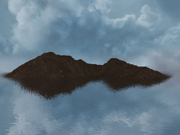
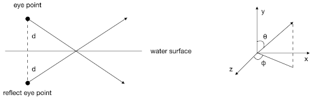

# Water simulation based on dudv map

From puddles to ponds, we can see ripples everywhere in the real world.
Their change in the height can be ignored even we change our view point.
This method is suitable for simulating those ripples,
and it is used widely in video games (e.g. _Dark Souls_).

I implement this method based on the video of [ThinMatrix](https://www.youtube.com/watch?v=HusvGeEDU_U&list=PLRIWtICgwaX23jiqVByUs0bqhnalNTNZh) and [1].

# License

The MIT License (MIT)

Copyright (c) 2021, Jiang Ye

Permission is hereby granted, free of charge, to any person obtaining a copy of this software and associated documentation files (the "Software"), to deal in the Software without restriction, including without limitation the rights to use, copy, modify, merge, publish, distribute, sublicense, and/or sell copies of the Software, and to permit persons to whom the Software is furnished to do so, subject to the following conditions:

The above copyright notice and this permission notice shall be included in all copies or substantial portions of the Software.

THE SOFTWARE IS PROVIDED "AS IS", WITHOUT WARRANTY OF ANY KIND, EXPRESS OR IMPLIED, INCLUDING BUT NOT LIMITED TO THE WARRANTIES OF MERCHANTABILITY, FITNESS FOR A PARTICULAR PURPOSE AND NONINFRINGEMENT. IN NO EVENT SHALL THE AUTHORS OR COPYRIGHT HOLDERS BE LIABLE FOR ANY CLAIM, DAMAGES OR OTHER LIABILITY, WHETHER IN AN ACTION OF CONTRACT, TORT OR OTHERWISE, ARISING FROM, OUT OF OR IN CONNECTION WITH THE SOFTWARE OR THE USE OR OTHER DEALINGS IN THE SOFTWARE.

# Dudv map

A dudv map [2] is a texture used to distort another texture.
`du` and `dv` are offsets applied to some texture coordinate `(u, v)`,
i.e. using `(u + du, v + dv)` to sample a texture instead of `(u, v)`.
`(du, dv)` pairs are recorded in a texture (or a lookup table).
As a result, the original texture is distorted to a certain pattern.

## Questions about generating dudv map

Many articles point out that the dudv map is the first order derivative of a normal map [1, 2].
But unfortunately, none of them have explained why.

The only thing that I can understand is as following:

When the original plane is (imaginarily) distorted to a curved surface,
the normal of a certain point changes.
Subsequently, the reflection of this point changes from `(u, v)` to `(u + du, v + dv)`.
The offset `(du, dv)` is what we want to calculate,
and it is related to the change of normal.

The first derivative of normal, i.e.`(d(nx)/dx, d(ny)/dy, d(nz)/dz)`,
represents the change of normal in space,
not the change of normal between the original plane and the distorted one.
This confuses me a lot,
and none of those articles have provided more details.

Personally, I think `(du, dv) <- (n1 - n2).xz * someScale` makes more sense.
`(n1 - n2)` represents the geometry difference between the original plane and the distorted one,
and `someScale` is a scalar to adjust this difference.

## A guess

As the normal map used in the water simulation has a wavy pattern,
its first derivative of `(x, y, z)`,
i.e. the change of surface normals in the space, also has a wavy pattern.
Therefore, distorting the water texture with this wavy pattern can produce a wavy surface.

I guess the key is how to get a wavy pattern that is related to surface normals,
not the difference between the original plane and the distorted one.

# User-defined clip plane

The reflection and refraction textures are faked by a technique called [user-defined clip plane](https://www.khronos.org/opengl/wiki/Vertex_Post-Processing#User-defined_clipping).

We specify a plane `(A, B, C, D)`, with `(A, B, C)` being its normal and `-D` being its distance to `(0, 0, 0)`.
For a point `P` in the space, `dot(P, plane)` gives the relationship between `P` and `plane`.
Here, `P` is expanded to `vec4` with `w = 1`.

    dot(P, plane) >= 0 --> non-negative side of the plane --> inside clipping space
    dot(P, plane) < 0 --> negative side of the plane --> outside clipping space

Points on the negative side of the plane will not be rendered.

For example, plane `(0, 1, 0, -2)` represents a plane that its normal is `(0, 1, 0)`
and its distance to the origin is `2` (i.e. `y = 2`).
Only vertices whose `position.y >= 2` within the viewport frustum will be rendered.

# Eye point for reflection

Before rendering the reflection texture,
don't forget to change the eye point.

First, move the eye point to the symmetric position of the water surface by

    float d = 2.0 * (eyePoint.y - waterSurface.y);
    vec3 eyePointReflect = vec3(eyePoint.x, eyePoint.y - d, eyePoint.z);

Second, change the viewing angle.
This is based on what coordinate system you use.
For example, if you use the one in the image, you should do something like

    float thetaReflect = 3.1415f - theta;

Finally, don't forget to change the eye point back after rendering.

# Performance

Currently, this program renders the same scene `three` times per frame.
One for the reflection frame buffer, one for the refraction frame buffer,
and one for the main window.

This may not be a problem for simple scenes.
However, video games always have complex scenes,
and rendering such scenes `three` times per frame is too expensive.

An effective way to improve performance is using level of detail (LOD) technique.
For example, using a height map and an LOD tessellation shader for rendering terrain.

# Shading

Blend a deep water color and a sub-surface water color [4] based on the depth value from the view point.
The combination of the shading code is based on [1, 3].

# Reference

[1] Truelsen, Rene. "Real-time shallow water simulation and environment mapping and clouds." (2007).

[2] polycount wiki: [dudv map](http://wiki.polycount.com/wiki/DuDv_map)

[3] Li, Bo, et al. "A practical method for real-time ocean simulation." 2009 4th International Conference on Computer Science & Education. IEEE, 2009.

[4] Ang, Nigel, et al. "The technical art of sea of thieves." ACM SIGGRAPH 2018 Talks. 2018. 1-2.
